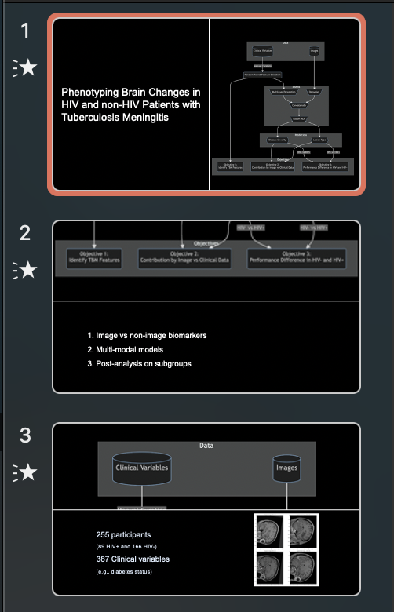
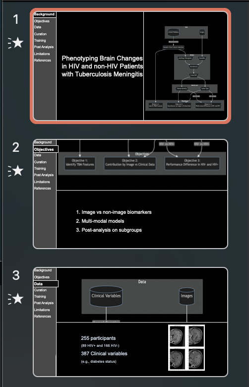

# Timeline for PowerPoint

This project is about adding a timeline (with smooth transitions) in Microsoft PowerPoint slides.

## Demo


## Preview Compare
|      Before Processing       |      After Processing      |
|:----------------------------:|:--------------------------:|
|  |  |


## Use

```python
tags = [
    "Background",
    "Objectives",
    "Data",
    "Curation",
    "Training",
    "Post Analysis",
    "Post Analysis",
    "Limitations",
    "References",
]
example_ppt = Presentation(path_ppt)
```
# Configurations
The width of this timeline, color, outline of the pointer are all configurable:

```python
sidebar_width = 0.12
sidebar_item_height = 0.06
sidebar_item_font = "Arial"
sidebar_init_font_size = 16
sidebar_item_font_color = RGBColor(255, 255, 255)
sidebar_color = RGBColor(*hex_to_rgb("#5A5A5A"))
sidebar_color_outline = RGBColor(*hex_to_rgb("#FFFFFF"))
sidebar_transparency = 50000  # 50% transparency, alpha * 100000)

indicator_color = RGBColor(*hex_to_rgb("#111111"))
indicator_transparency = 80000
```

# Disclaimer
This project is under development, with further refinements and feature additions in progress. Your feedback and contributions are highly appreciated. This is probably the dirtiest piece of code I have written, and I blame it on python-pptx, on which this project, out of no other choice, is based. Although useful it is a horrible package with irregular syntax and poor documentation.
