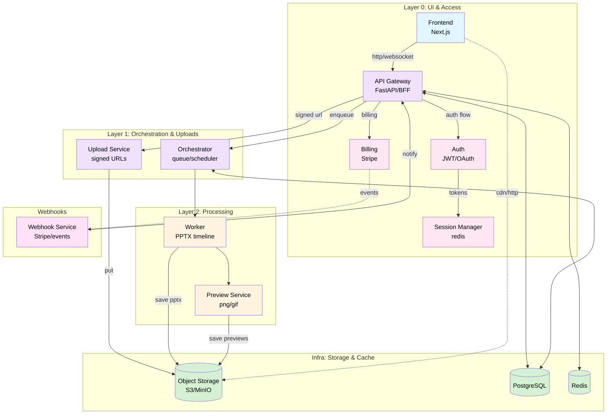

## todo
[todo-list](TODO.MD)
[api-standards](docs/apis/README.MD)

## running
```bash
docker-compose up -d
docker-compose logs -f frontend
docker-compose down
docker-compose up -d --build
```

## repositories

### production architecture

| service               | layer | description                                          |
| --------------------- | ----- | ---------------------------------------------------- |
| [frontend](frontend/) | 0     | Next.js UI for uploading PPTX and managing timelines |
| api-gateway           | 0     | FastAPI BFF: routing, auth, signed uploads           |
| auth-service          | 0     | Authentication/authorization (JWT/OAuth)             |
| billing-service       | 0     | Subscriptions & payments (Stripe)                    |
| orchestrator          | 1     | Job coordination & scheduling (queue)                |
| upload-service        | 1     | Signed URLs, antivirus, file intake                  |
| worker                | 2     | PPTX processing (timeline generation)                |
| preview-service       | 2     | Thumbnails/GIF rendering for UI previews             |
| webhook-service       | 0     | Stripe/webhook ingestion (billing, job status)       |
| storage               | infra | Object storage (S3/MinIO)                            |
| db                    | infra | PostgreSQL: users, timelines, jobs                   |
| cache                 | infra | Redis: sessions, cache, job queue                    |
| cdn                   | infra | CDN for preview assets                               |

```yaml
services:
  # user-facing layer
  frontend:          # next.js (layer 0)
  api-gateway:       # fastapi (routing, auth, signed uploads)
  auth-service:      # jwt/oauth (layer 0)
  billing-service:   # stripe subscriptions (layer 0)
  webhook-service:   # stripe/webhooks → api events

  # orchestration
  orchestrator:      # job scheduler/queue manager (layer 1)
  upload-service:    # signed uploads + validation (layer 1)

  # processing
  worker:            # pptx timeline processing (python worker) (layer 2)
  preview-service:   # thumbnails/gif generation (layer 2)
```

## infrastructures
```yml
postgres:    # users, timelines, jobs
s3/minio:    # pptx originals + rendered previews
redis:       # sessions, cache, job queue
rabbitmq:    # message broker for workers (or use redis)
cdn:         # edge delivery for preview assets
```

## WBS

```mermaid
graph TB
  subgraph "Layer 0: UI & Access"
    FE[Frontend<br/>Next.js]
    API[API Gateway<br/>FastAPI/BFF]
    AUTH[Auth<br/>JWT/OAuth]
    BILL[Billing<br/>Stripe]
    SESS[Session Manager<br/>redis]
    FE -->|http/websocket| API
    API -->|auth flow| AUTH
    AUTH -->|tokens| SESS
    API -->|billing| BILL
  end

  subgraph "Layer 1: Orchestration & Uploads"
    UP[Upload Service<br/>signed URLs]
    JOBS[Orchestrator<br/>queue/scheduler]
    API -->|signed url| UP
    API -->|enqueue| JOBS
  end

  subgraph "Infra: Storage & Cache"
    OBJ[(Object Storage<br/>S3/MinIO)]
    DB[(PostgreSQL)]
    CACHE[(Redis)]
    UP -->|put| OBJ
    API <--> DB
    API <--> CACHE
    JOBS <--> DB
  end

  subgraph "Layer 2: Processing"
    WRK[Worker<br/>PPTX timeline]
    PREV[Preview Service<br/>png/gif]
    JOBS --> WRK
    WRK -->|save pptx| OBJ
    WRK --> PREV
    PREV -->|save previews| OBJ
  end

  subgraph "Webhooks"
    WH[Webhook Service<br/>Stripe/events]
    BILL -.events.-> WH
    WH -->|notify| API
  end

  FE -.cdn/http.-> OBJ

  style FE fill:#e1f5ff,color:#000
  style AUTH fill:#ffe6f0,color:#000
  style BILL fill:#ffe6f0,color:#000
  style SESS fill:#ffe6f0,color:#000
  style API fill:#f0e1ff,color:#000
  style UP fill:#f0e1ff,color:#000
  style JOBS fill:#f0e1ff,color:#000
  style OBJ fill:#d4f1d4,color:#000
  style DB fill:#d4f1d4,color:#000
  style CACHE fill:#d4f1d4,color:#000
  style WRK fill:#fff4e1,color:#000
  style PREV fill:#fff4e1,color:#000
  style WH fill:#ffe1f5,color:#000

  click FE "frontend/" "Open frontend app"
```
