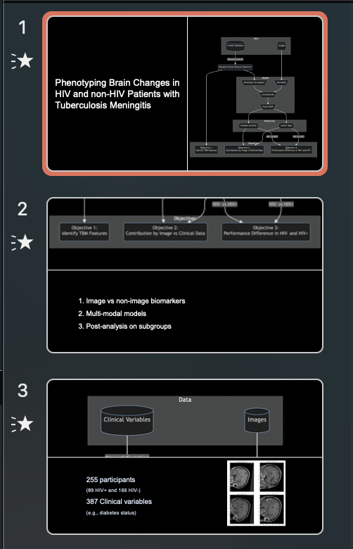
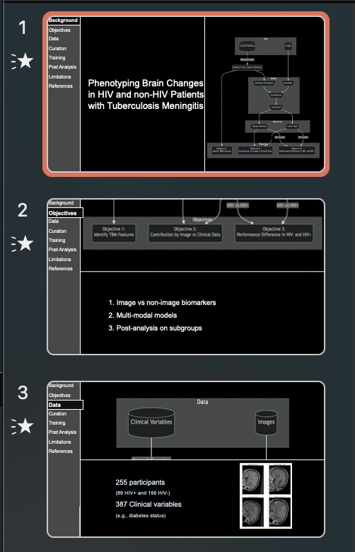

# Timeline for PowerPoint
This project is about adding a timeline (with smooth transitions) in Microsoft PowerPoint slides.

## Demo


## Preview Compare
|      Before Processing       |      After Processing      |
| :--------------------------: | :------------------------: |
|  |  |


## Use

```python
from pathlib import Path
from pptx import Presentation
from timeline import set_sidebar_timeline, move_elements_to_right


if __name__ == "__main__":
    path_ppt = Path("~/example.pptx")
    tags = ["Intro"] * 33

    example_ppt = Presentation(path_ppt)

    move_elements_to_right(example_ppt, sidebar_width=0.12)
    set_sidebar_timeline(ppt=example_ppt, tags=tags, sidebar_item_height=0.10)

    example_ppt.save(path_ppt.parent / "timeline.pptx")
```