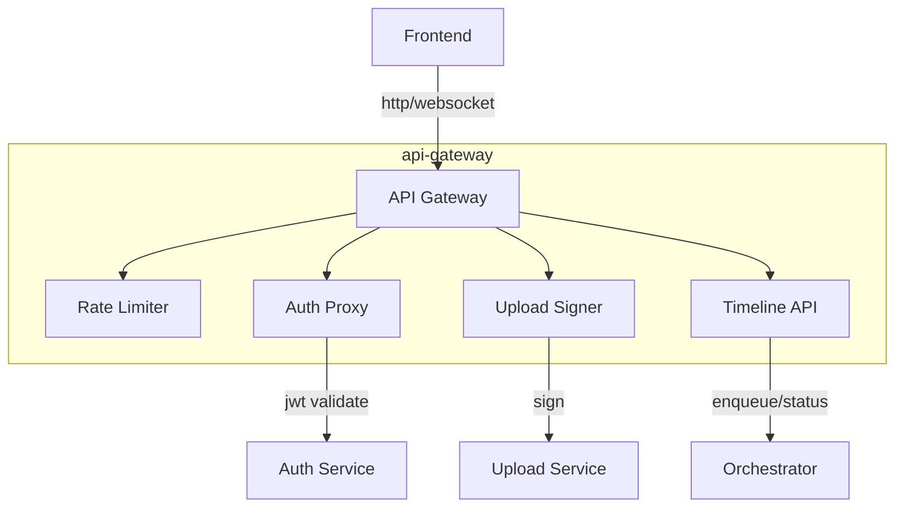

# api-gateway

layer: 0 (bff/api). routes frontend requests, handles auth, signs uploads, and exposes job/status endpoints.

## responsibilities
- routing and rate limiting
- auth handoff (jwt) and session checks
- pre-signed upload urls for pptx files
- timeline job submit/status apis

## interface
| direction | data                  | protocol   | peer            |
| --------- | --------------------- | ---------- | --------------- |
| input     | http requests         | http/json  | frontend        |
| output    | auth checks           | http/json  | auth-service    |
| output    | signed upload urls    | http/json  | upload-service  |
| output    | job submit/status     | http/json  | orchestrator    |

## wbs

