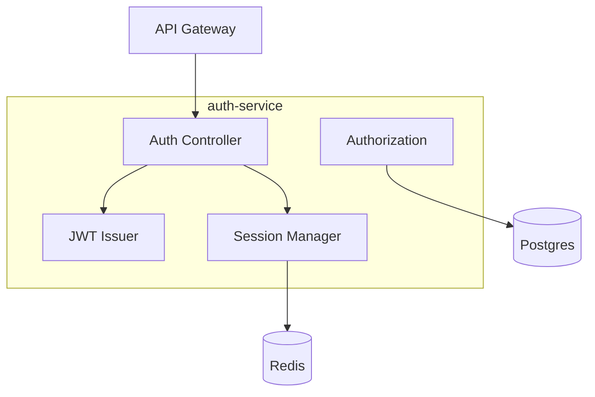

# auth-service

layer: 0 (identity & access). issues and validates jwt, manages sessions and roles.

## responsibilities
- login/signup, token issuance
- jwt validation and role checks
- session storage and revocation

## interface
| direction | data            | protocol  | peer         |
| --------- | --------------- | --------- | ------------ |
| input     | credentials     | http/json | api-gateway  |
| output    | jwt/session     | http/json | api-gateway  |
| output    | token validate  | http/json | all services |

## wbs

