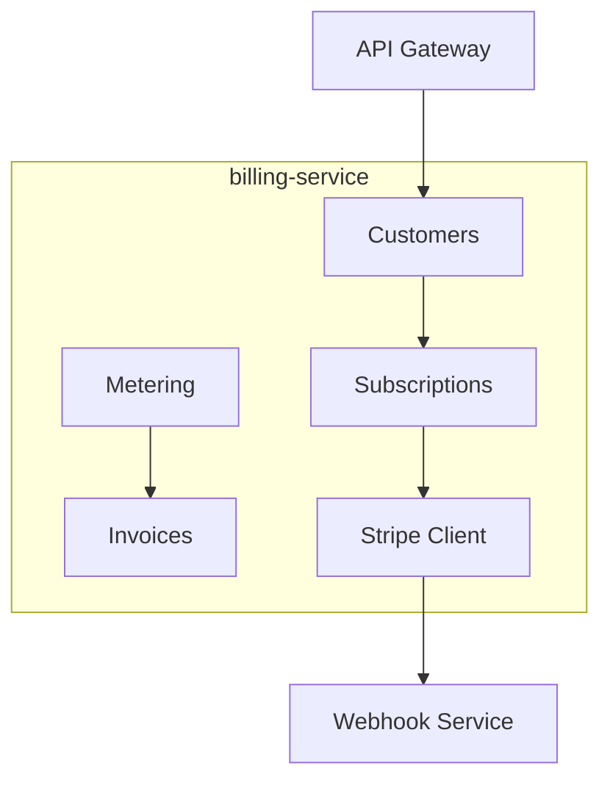

# billing-service

layer: 0 (billing). subscriptions, plans, metering, and payments (stripe).

## responsibilities
- customer + subscription lifecycle
- usage metering and plan limits
- invoices, webhooks handoff

## interface
| direction | data            | protocol  | peer            |
| --------- | --------------- | --------- | --------------- |
| input     | billing actions | http/json | frontend        |
| input     | auth tokens     | jwt/http  | auth-service    |
| output    | events          | http/json | webhook-service |

## wbs

