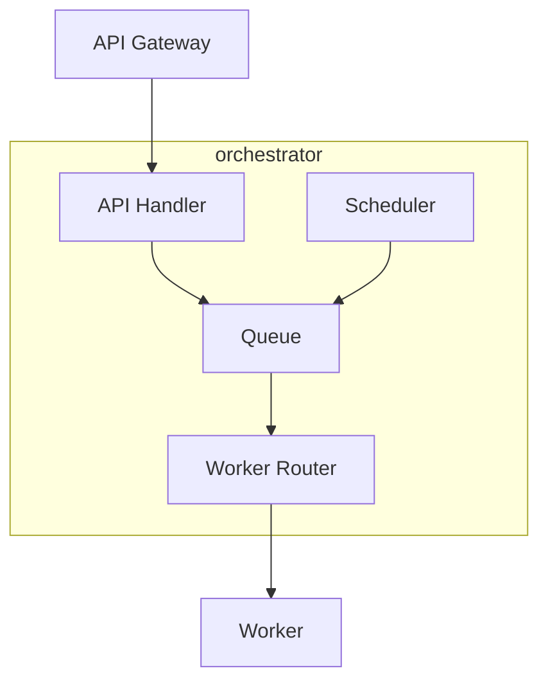

# orchestrator

layer: 1 (orchestration). schedules and tracks pptx processing jobs.

## responsibilities
- enqueue timeline jobs
- track job state and retries
- route work to worker service

## interface
| direction | data         | protocol  | peer        |
| --------- | ------------ | --------- | ----------- |
| input     | job requests | http/json | api-gateway |
| output    | work items   | queue     | worker      |

## wbs

