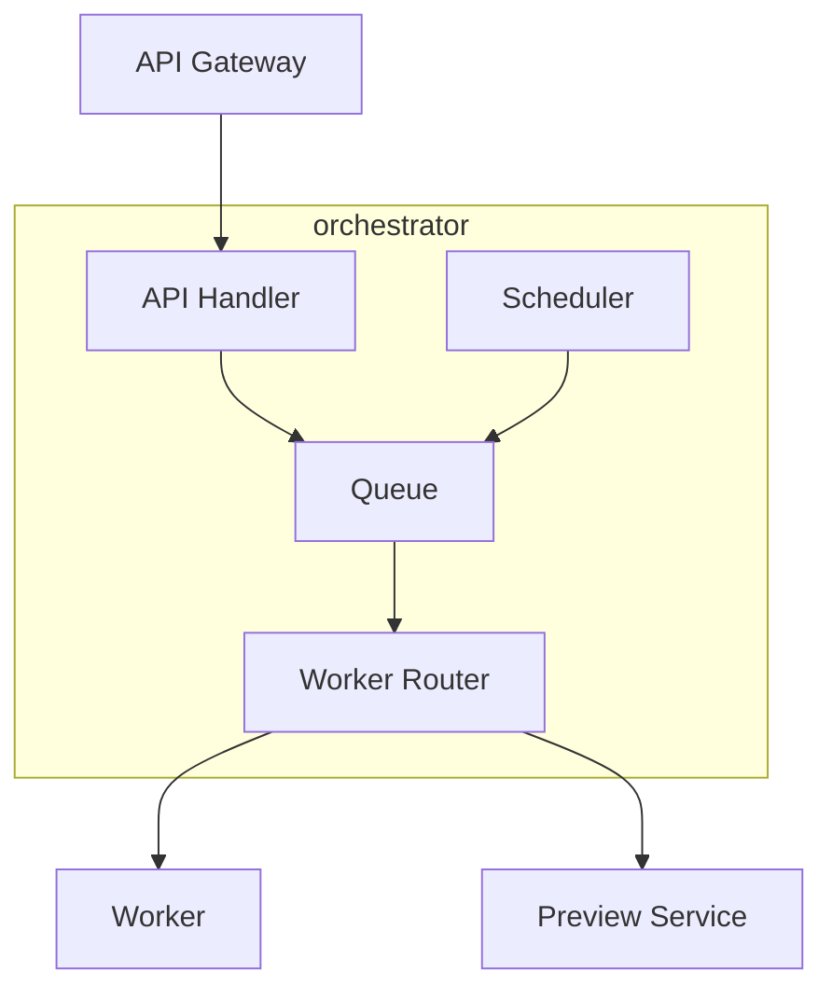

# orchestrator

layer: 1 (orchestration). schedules and tracks pptx processing jobs and preview generation.

## responsibilities
- enqueue timeline jobs
- track job state and retries
- fan-out to worker and preview-service

## interface
| direction | data          | protocol  | peer            |
| --------- | ------------- | --------- | --------------- |
| input     | job requests  | http/json | api-gateway     |
| output    | work items    | queue     | worker          |
| output    | preview tasks | queue     | preview-service |

## wbs

