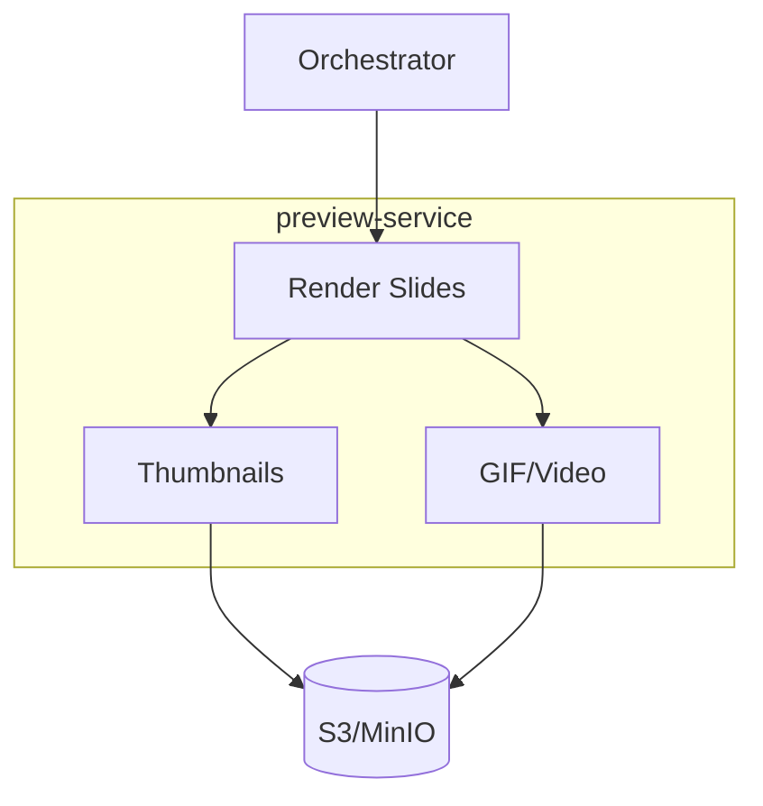

# preview-service

layer: 2 (processing). renders thumbnails and animated previews for the ui.

## responsibilities
- render png thumbnails from pptx
- generate gif/video previews
- write results to object storage

## interface
| direction | data          | protocol | peer         |
| --------- | ------------- | -------- | ------------ |
| input     | preview task  | queue    | orchestrator |
| output    | preview files | s3/http  | storage      |

## wbs

