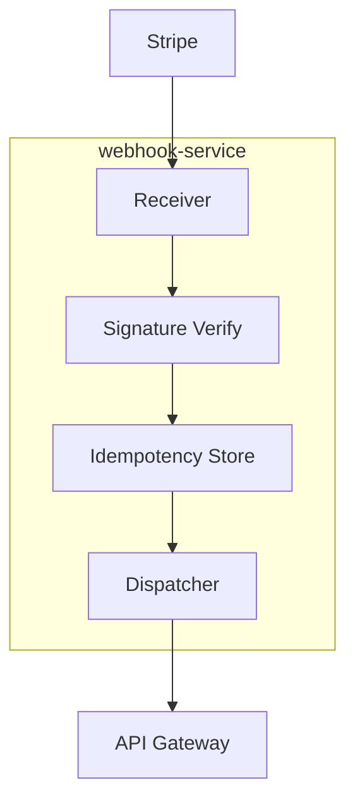

# webhook-service

layer: 0 (events). ingests external webhooks (stripe, status) and forwards internal events.

## responsibilities
- receive stripe events securely
- idempotent processing, retries, dlq
- notify api/fe of billing or job status changes

## interface
| direction | data          | protocol  | peer          |
| --------- | ------------- | --------- | ------------- |
| input     | stripe events | http/json | stripe        |
| output    | updates       | http/json | api-gateway   |

## wbs

