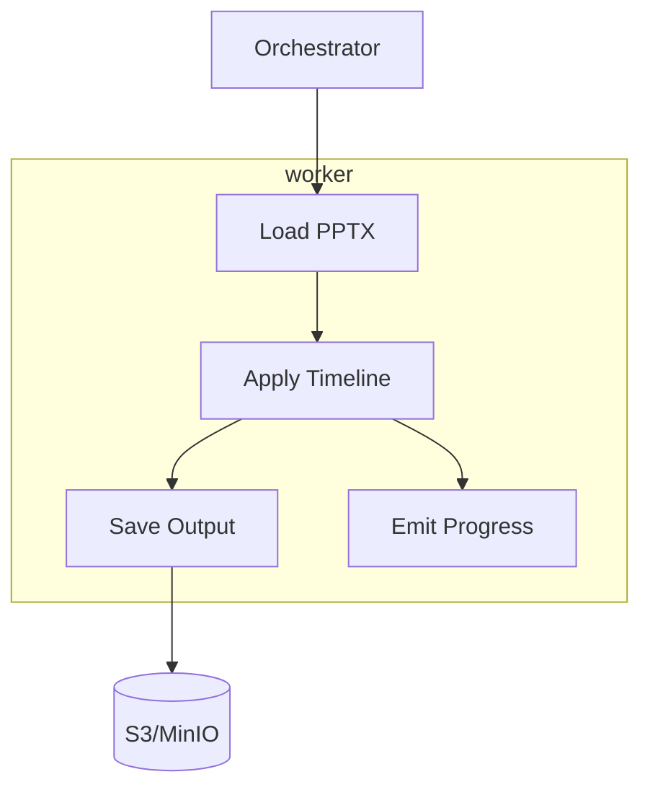

# worker

layer: 2 (processing). runs pptx timeline transformation and saves outputs.

## responsibilities
- apply timeline transformations
- save processed pptx
- emit progress + errors

## interface
| direction | data        | protocol | peer         |
| --------- | ----------- | -------- | ------------ |
| input     | work item   | queue    | orchestrator |
| output    | pptx output | s3/http  | storage      |

## wbs

